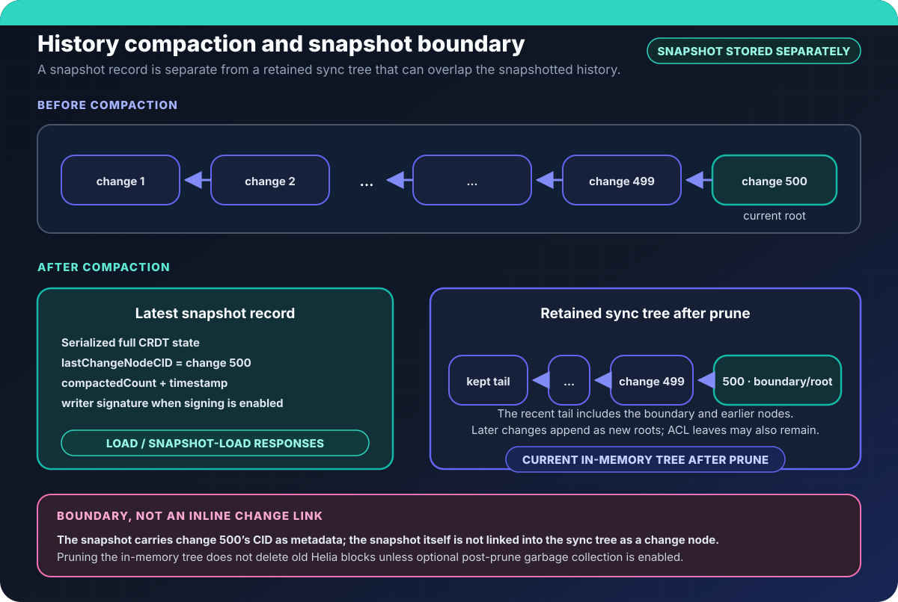

# History compaction

Peerborne stores document changes as a Merkle DAG. Without pruning, the retained
change tree and its encrypted blocks grow as edits accumulate. Compaction creates
a snapshot and retains a configurable tail of document changes while preserving
ACL nodes. It does not establish durable storage or recovery by itself.

## Snapshot creation and retention

An authorized writer can call `snapshot()` when its CRDT provider implements
`getSnapshot()`. Automatic snapshot creation is disabled by default. A snapshot
records the serialized state, boundary CID, compacted count, timestamp, and
creator signature. Its exact type is
[`CRDTSnapshotNode`](../packages/core/src/snapshot-node.ts).

The snapshot is stored in `_latestSnapshot`, separately from the retained sync
tree. It is served in authenticated load responses; incremental pubsub messages
do not include it. Yjs snapshots are full-state updates. Automerge snapshots use
its save format and are applied through `CRDTProvider.applySnapshot()`.

Pruning removes older document payloads from the in-memory sync tree. ACL nodes
are retained as leaves. The retained tail may overlap the snapshot boundary;
after applying a snapshot, the receiver records that boundary in `_hashes` so
it does not reapply its ancestors.

Pruning does not delete Helia blocks by default. With `gcAfterPrune: true`, an
asynchronous GC pass unpins and deletes eligible pruned blocks. It excludes
blocks still reachable from the retained tree and the snapshot boundary. GC
errors do not fail the document mutation. `_hashes` retains known CIDs for
deduplication even after a corresponding block is deleted.

`hasChange(cid)` checks that known-CID set. `loadChangeBlock(cid)` loads and
decrypts a known block, returning `undefined` for an unknown or unavailable
block. Malformed CIDs throw. It does not automatically recover missing blocks
from another peer.

## Current load protocols

All peers use the protocols declared in
[`wire-protocols.ts`](../packages/core/src/wire-protocols.ts):

- `/peerborne/doc-load/4.0.0`
- `/peerborne/snapshot-load/4.0.0`
- `/peerborne/security-advertise/1.0.0`

A load request signs the document path and a fresh challenge. A normal load
response has the `load-response-v4` signature context and must bind that
challenge, the served frontier, the complete response manifest, and locally
trusted control/group commitments. Snapshot bytes and metadata are included in
the manifest along with the retained tree and keychain changes. The receiver
requires a captured trusted writer before applying state. An ACL supplied by
the responding peer cannot establish that initial trust on its own.

A response may include a snapshot plus retained changes, or the full retained
history when no snapshot exists. Both use the same current authenticated
contract. Snapshot-load requests can fall back to document-load when a peer has
no snapshot; there is no fallback to an earlier protocol or unsigned load.

An accepted invitation uses the separate issuer-pinned
`/peerborne/invitation-catch-up/1.0.0` protocol. It does not fabricate the trusted
group commitments required by normal V4 loading. See
[the initial-load security model](../site/src/content/docs/concepts/security.md)
and [the alpha format policy](../MIGRATING.md).

## Snapshot verification

Normal network loads require signing. After authenticating the complete load
response, the receiver applies authenticated ACL entries and verifies the
snapshot signature against authorized writer keys. The optional embedded
`publicKey` is not trusted as an authorization source. The signature covers the
versioned binary payload documented in
[`snapshot-node.ts`](../packages/core/src/snapshot-node.ts), including the state,
boundary CID, timestamp, and compacted count.

When both local and received snapshots are valid, the receiver prefers the one
with the greater `compactedCount`, then the lexicographically greater boundary
CID on a tie. This deterministic preference is not a freshness proof. Fresh
load challenges and trusted security commitments are separate admission checks.

Snapshot application uses the provider's `applySnapshot()` when its full-state
format differs from incremental changes; providers whose snapshots are valid
updates can use `remoteChange()`. Later retained changes are then applied.

## Configuration

The current defaults in
[`compaction-config.ts`](../packages/core/src/compaction-config.ts) are:

| Setting | Default | Purpose |
| --- | --- | --- |
| `enabled` | `false` | Enable automatic snapshot creation explicitly |
| `snapshotInterval` | `500` | Edits between automatic snapshots |
| `minChangesBeforeSnapshot` | `100` | Minimum edits before the first snapshot |
| `pruneAfterSnapshot` | `true` | Prune the in-memory served tree |
| `gcAfterPrune` | `false` | Opt into deleting eligible pruned Helia blocks |
| `keepRecentNodes` | `50` | Retain this many recent document change nodes |

## Evidence and limits

Focused tests cover
[snapshot metadata and signing](../packages/core/src/snapshot-node.test.ts),
[configuration](../packages/core/src/compaction-config.test.ts), and
[pruning and GC decisions](../packages/core/src/compaction.test.ts).
These do not establish long-running, concurrent multi-peer compaction or durable
recovery. Refer to [the feature audit](../docs/feature-audit.md) for current
capability boundaries.
