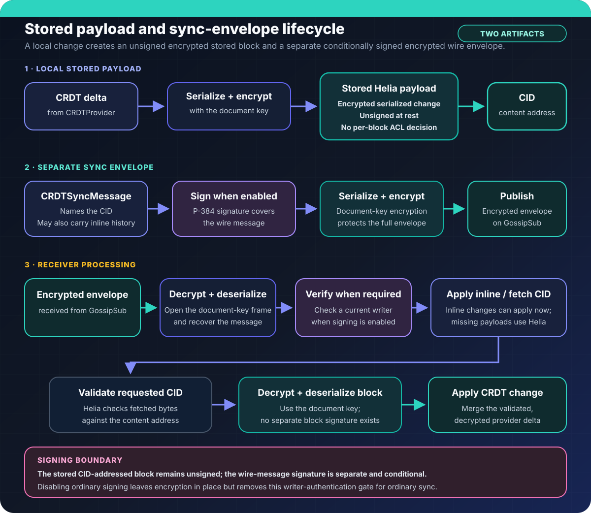
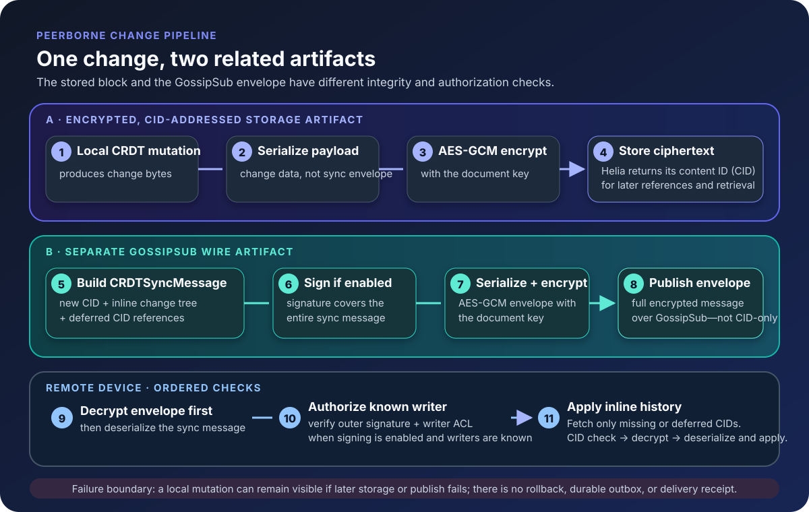

# Document Change Security Flows

The current change path creates two related artifacts. The serialized CRDT
change is encrypted with the document key and stored by CID without its own
application signature. A separate sync envelope carries history references,
is signed when ordinary document signing is enabled, and is then encrypted for
transport. Receivers decrypt the envelope and, when signing is enabled, verify
the writer before applying validated history.

_Stored payloads and sync envelopes have separate integrity and authorization
checks._

The full change pipeline also shows CID creation, inline and deferred history,
and the receiver's ordered checks:

_One local change creates distinct storage and wire artifacts. See the
[security concept](../site/src/content/docs/concepts/security.md) for the
current guarantees and limitations._

## References

- [Web Cryptography API: symmetric encryption](https://jameshfisher.com/2017/11/02/web-cryptography-api-symmetric-encryption/)
- [TypeScript generics](https://www.typescriptlang.org/docs/handbook/2/generics.html)
- [JavaScript typed arrays](https://developer.mozilla.org/en-US/docs/Web/JavaScript/Typed_arrays)

# SubtleCrypto Algorithms

## Key Type

https://developer.mozilla.org/en-US/docs/Web/API/CryptoKey

## Encrypt

https://developer.mozilla.org/en-US/docs/Web/API/SubtleCrypto/encrypt

### Symmetric Algorithms

All symmetric algorithms require shared key material used to encrypt and
decrypt. The supported AES modes are:

- CTR
- CBC
- GCM

> GCM does provide built-in authentication, and for this reason it's often recommended over the other two ... GCM is an "authenticated" mode, which means that it includes checks that the ciphertext has not been modified by an attacker

`AesGcmParams`:

- `name`: `AES-GCM`
- `iv`: a 96-bit `BufferSource` that must be unique for every encryption
  operation with the same key; it does not need to be secret
- `tagLength`: optional authentication-tag length; defaults to 128 bits

## Sign

### Public-Key Algorithms

Three of these algorithms (RSASSA-PKCS1-v1_5, RSA-PSS, and ECDSA) are public-key
