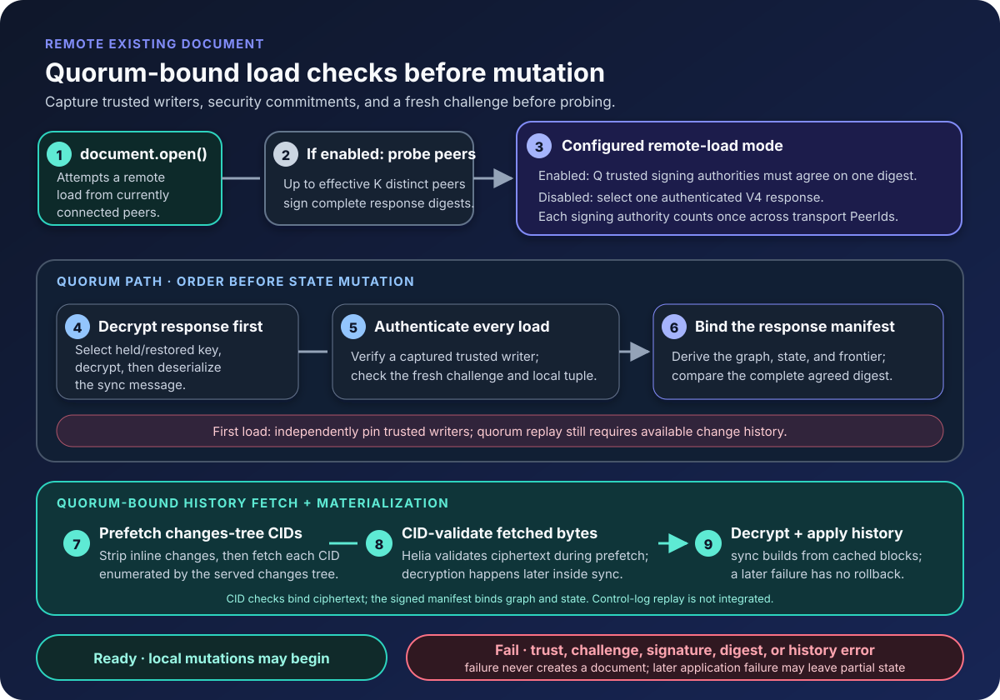
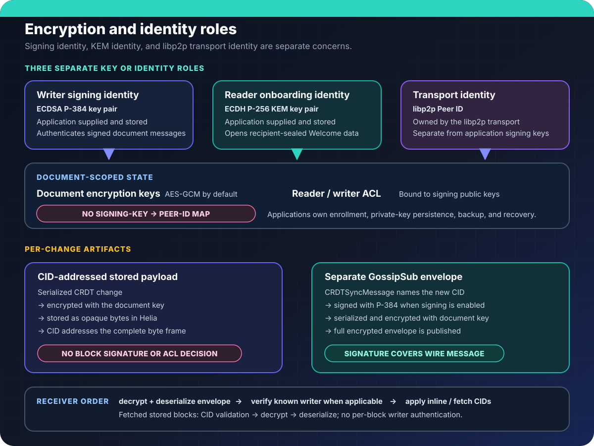

Peerborne composes several open-source subsystems into a coherent local-first stack. This page describes how the pieces fit together.

## Package dependency graph

## Data flow: writing a change

The local replica changes before either outbound artifact is complete. First,
Peerborne serializes the change payload, encrypts it with the document key, and
stores that ciphertext in Helia under its CID. It then builds a separate
`CRDTSyncMessage` containing the new CID, inline change history, and any deferred
CID references. The complete sync message is signed when signing is enabled,
serialized, encrypted, and published through GossipSub; the publication is not
a CID-only announcement.

A receiving peer decrypts the GossipSub envelope before deserializing it and,
when signing is enabled, checking the outer signature against known authorized
writers. It applies inline history directly and fetches only missing or deferred
CID references. Helia validates fetched ciphertext against the requested CID;
Peerborne then decrypts and deserializes the stored change payload. Those stored
blocks do not carry their own writer signature or ACL decision. A storage or
publication error can reject `change()` after the mutation is already visible
locally. There is no automatic rollback, durable outbox, or remote delivery
receipt.

**Evidence boundary:** the component pipeline and its failure semantics are
implemented and covered by focused tests. Live post-load browser mutation and
convergence through this complete path are not yet demonstrated in CI.

## Data flow: loading an existing document

Normal network loading uses V4 exclusively. Before probing, the loader captures
canonical trusted signing authorities, a locally resolved control/group tuple,
and a fresh 32-byte challenge. A first load needs
`resolveTrustedDocumentWriters`; normal loading and serving need
`resolveLoadSecurityCommitments`. Applications must supply independently trusted
state. The runtime does not yet verify an MLS genesis or replay a newer control
suffix from peers.

Quorum probes count each authenticated signing authority once across transport
PeerIds. The agreed digest binds the document, served frontier, captured tuple,
and a complete response manifest containing node kinds, edges, inline payloads,
snapshot content/metadata, and keychain changes. The selected response must echo
the fresh challenge, match the local tuple, verify under a captured writer, and
reproduce that digest before mutation. Disabling quorum allows one trusted
signed V4 response; challenge, tuple, signature, and frontier checks remain.

Quorum loads strip inline changes and prefetch the served tree's CIDs through
Helia before mutation. CID validation covers ciphertext bytes; signed manifests
bind the accompanying graph. A first load still drops a snapshot that cannot be
verified against a prior ACL and requires available change history. Later
provider failures can leave partial state; there is no rollback, and incomplete
bootstrap instances must be discarded.

Invitation acceptance uses its independently pinned issuer and a separate
challenge-bound catch-up protocol. It does not claim MLS control-log validation.
`document.create()` explicitly authorizes a new document at an application-owned
path. `open()` never converts a failed load or an empty peer response into a new
document. Focused adversarial tests cover these boundaries; a hostile real-peer
V4 quorum test remains outstanding.

## The sync model

Peerborne uses a **shadow sync graph** rather than putting its graph links inside
each stored block:

- Each `document.change()` call stores an encrypted serialized change payload in Helia; the CID addresses the resulting ciphertext.
- A separate `CRDTSyncMessage` names the new CID and carries an inline shadow change tree whose child keys reference earlier CIDs; older cross-links may be deferred to CID-only references.
- The complete sync message is signed when signing is enabled, then serialized, encrypted, and published through GossipSub.
- Receivers apply inline history and fetch only missing or deferred CID blocks on demand through the configured block-fetch path.
- The CRDT layer resolves concurrent edits without a consensus leader.

This model is **eventually consistent**: local edits apply immediately, remote edits merge when they arrive. There is no global ordering, no server-assigned sequence number, and no single source of truth.

## Peer-to-peer networking stack

## Encryption and identity

Peerborne does not transmit private signing or KEM keys. Public identity keys
are exchanged as protocol inputs. When reader KEM enrollment is configured, a
writer sends a writer-signed Welcome whose recipient-bound ECIES-sealed payload
contains a visibility-filtered keychain delta and BeeKEM bootstrap data. Later
BeeKEM PathUpdates let surviving readers derive a new root, from which
Peerborne derives the next document epoch key. Applications still own identity
enrollment, private-key storage, backup, and recovery.

## Where infrastructure is needed

Peerborne documents can sync over peer-to-peer links, but most deployments need supporting infrastructure:

| Component | Required? | Purpose |
|---|---|---|
| **Relay node** | For browser peers | Bridges NAT; peers behind restrictive firewalls connect through it |
| **Bootstrap node** | For initial discovery | Provides a well-known entry point for the libp2p network |
| **STUN/TURN server** | For WebRTC direct connections | Helps peers establish direct browser-to-browser links |
| **Remote pinning** | Not implemented | Would persist encrypted blocks when all local peers go offline; no authenticated pin-request protocol or publisher exists |
| **Identity service** | Application responsibility | Peerborne does not provide user authentication or key management |

The relay server source is in `relay-server/`. The Docker Compose files in the repository root provide ready-to-run multi-node topologies for testing.

## Current limitations

See the [limitations page](../limitations/) for a complete list. Key architectural limitations to be aware of:

- **No durable outbox**: local blocks are stored in IndexedDB, but an unreachable peer may not receive the update; there is no delivery retry queue
- **No durable reconnect-and-replay guarantee**: libp2p may redial and explicit loads or later sync history may catch a peer up, but connection restoration and replay of every missed update are not guaranteed
- **No pass/fail performance budgets**: benchmarks exist but have no thresholds
- **Pinning is incomplete**: the listener exists but the publisher does not
- **Browser restart recovery is unverified**: IndexedDB persistence works in tests but full close/reopen cycles are not proven in CI

## Next steps

- [Local-first design](../local-first/) — what "local-first" means in Peerborne
- [CRDT model](../crdts/) — how Yjs and Automerge integrate
- [Networking](../networking/) — transports, discovery, and NAT traversal
- [Security model](../security/) — threat model, encryption, and ACL
- [Storage](../storage/) — persistence, pinning, and recovery
