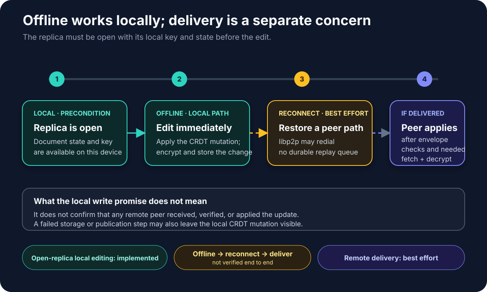

## Design intent

A local-first application stores its primary data on the user's device — not on a remote server. Changes apply to the local replica immediately, with zero network latency. The network is used to sync state between peers, not to enforce a global write order.

Peerborne adopts these local-first principles:

- **Local replica near the user.** The application reads and writes a local CRDT document. There is no server round-trip for reads or writes.
- **Work offline.** Once a replica is open—including a new local document—it can be edited without network access. Changes are applied immediately to the CRDT and stored locally in IndexedDB.
- **No server-ordained write ordering.** Two peers can edit the same document concurrently. The CRDT layer merges their changes when they eventually exchange updates.
- **Eventually consistent.** When peers reconnect, they may discover and fetch blocks that were created during the offline period. Delivery is not guaranteed — see limitations below.



**Evidence boundary:** open-replica editing and local storage are implemented.
The complete offline edit → reconnect → remote delivery sequence is not verified
end to end. Libp2p may redial keep-alive peers, but Peerborne supplies no
durable outbox, delivery receipt, or guarantee that a connection is restored
and missed announcements are replayed.

## What is implemented today

### Offline editing (open local replicas)

An open Peerborne document with its local state and key material available can
be edited offline. This includes a new document created locally without a peer
connection. The `document.change()` call applies the mutation to the local Yjs
or Automerge replica immediately. Its promise covers storing an encrypted
change payload, building and optionally signing a separate sync message,
encrypting that message, and attempting publication through GossipSub.

```ts
await todos.change((state) => {
  state.getArray<string>('items').push(['buy milk']);
});
```

The encrypted change payload is stored before publication is attempted, so it
can remain in local IndexedDB even if publication later fails. Libp2p may
restore some peer connections, but missed-update replay and delivery are not
guaranteed.

### What `change()` covers

The `document.change()` promise resolves when:

1. The CRDT provider has applied the mutation to the local replica
2. The change payload has been serialized and encrypted with the document key (AES-GCM by default)
3. The ciphertext has been stored in the local Helia blockstore, producing its CID
4. A separate `CRDTSyncMessage` has been built with that CID, inline history, and any deferred CID references
5. The complete sync message has been signed when signing is enabled, then serialized and encrypted with the document key (AES-GCM by default)
6. Publication of the full encrypted sync envelope through GossipSub has completed

If storage or publication fails (e.g., IndexedDB quota exceeded, network error), the CRDT mutation **may already be applied**. The CRDT state reflects the mutation even if the remote sync path failed. There is no automatic rollback.

## What is not yet implemented

### No durable outbox

If a peer is unreachable when `change()` publishes to GossipSub, the update may not reach them. Peerborne does not persist a queue of outgoing changes to retry later. There is no delivery acknowledgment or guaranteed-at-least-once semantics.

### No delivery acknowledgment

When a change is published, there is no confirmation that remote peers received, verified, or applied it. The application must implement its own acknowledgment protocol if it needs delivery guarantees.

### No durable reconnect-and-replay guarantee

Libp2p can redial peers tagged for keep-alive, including relay reservation
paths. Peerborne does not provide a durable reconnection/outbox protocol that
guarantees connection restoration or replays announcements missed while a peer
was offline. Applications that require recovery must observe connectivity and
coordinate their own retry, resynchronization, or acknowledgment flow. See the
[networking page](../networking/) for transport details.

### No close/restart recovery verified in CI

Documents store encrypted blocks in browser IndexedDB via Helia's blockstore. Local persistence works in single-session tests, but complete browser close → reopen → verify document state has not been proven in CI. See the [roadmap](../../community/roadmap/) for current status.

### Automerge/Yjs mutation persistence on rejection

If part of the `change()` pipeline fails (e.g., storage quota exceeded), the CRDT mutation may already be applied to the local replica. The mutation persists locally even though the remote sync failed. There is no automatic undo or rollback of the CRDT state.

## The infrastructure boundary

"Local-first" does not mean "infrastructure-free." Browser nodes do not bind
ordinary inbound TCP sockets. Peerborne's browser default nevertheless
advertises circuit-relay, WebRTC, and WebSocket listen addresses and enables
WebRTC, WebRTC Direct, WebTransport, and relay transports. Bootstrap discovery
is optional: without a configured bootstrap peer or an explicit `connect()`
address, the default node remains a swarm of one. The current cross-NAT
Peerborne acceptance test explicitly dials a Circuit Relay address; direct
WebRTC/WebTransport document sync and DHT behavior remain unverified.

Depending on the deployment topology, supporting infrastructure can include:

- **Relay nodes** to bridge NAT for browser peers
- **Bootstrap nodes** as well-known entry points for the libp2p network
- **STUN/TURN servers** for WebRTC hole-punching (optional, for direct peer connections)

A relay that does not hold the document key forwards ciphertext; bootstrap and
STUN provide discovery or address metadata rather than document plaintext.
Infrastructure components can still observe network metadata, and any
component that is also enrolled as an authorized document peer can decrypt
according to its keys.

See [running a relay](../../cookbook/running-a-relay/) for the development relay setup.

## What local-first Peerborne is a good fit for

Peerborne's local-first model works well for:

- **Small collaborative documents** (todos, notes, wikis, password vaults) where the document fits in a single CRDT replica
- **Applications that own identity and recovery** — Peerborne does not provide authentication or key recovery
- **Deployments where you control the relay infrastructure** — there is no cloud service to delegate to
- **Experiments and prototypes** learning about local-first architecture

It is not a good fit for:

- Large datasets (hundreds of megabytes per document)
- Applications that need SQL or relational queries
- Production systems requiring guaranteed delivery and durability
- Applications expecting a managed backend service

## CI-backed evidence

These behaviors are verified by CI:

- Document creation, local mutation, and retrieval in a single browser session
- Encrypted existing-history retrieval through Circuit Relay
- Automerge and Yjs provider initialization and basic operation
- Crypto operations (signing, encryption, key generation)

These behaviors are **not** verified:

- Browser restart and document recovery
- Multi-session persistence across browser closes
- Offline editing with later reconnection and delivery
- Guaranteed transport reconnection and missed-update replay

## Next steps

- [Architecture](../architecture/) — data flow and system structure
- [CRDT model](../crdts/) — how Yjs and Automerge integrate
- [Limitations](../limitations/) — complete list of current gaps
