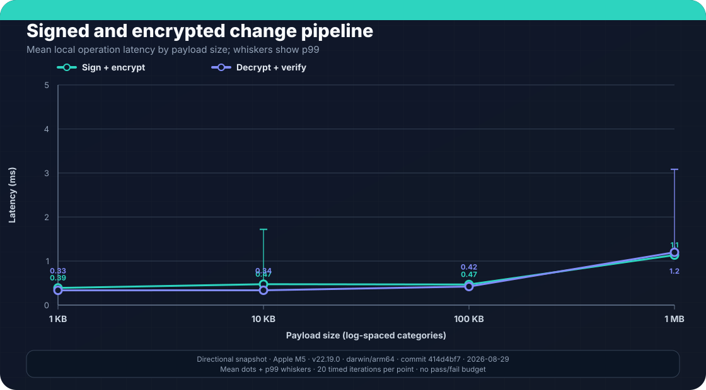
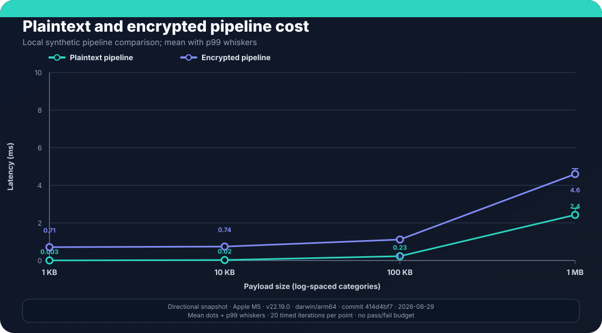
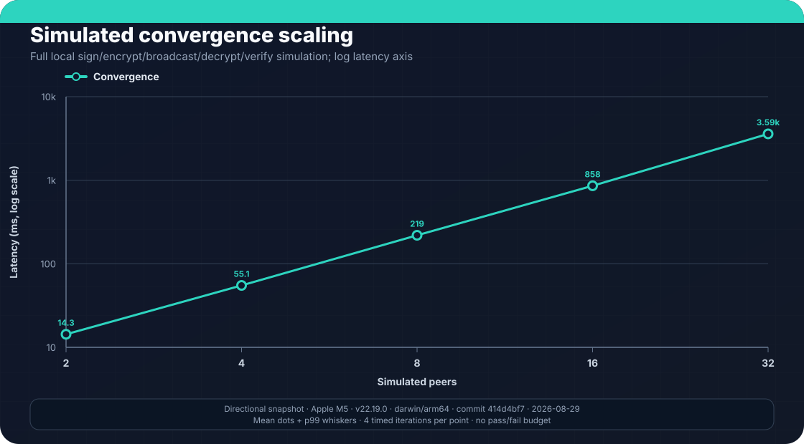
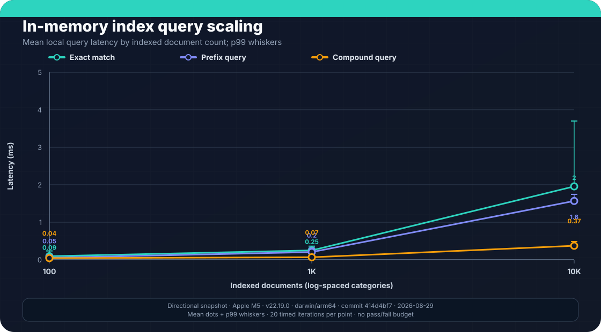
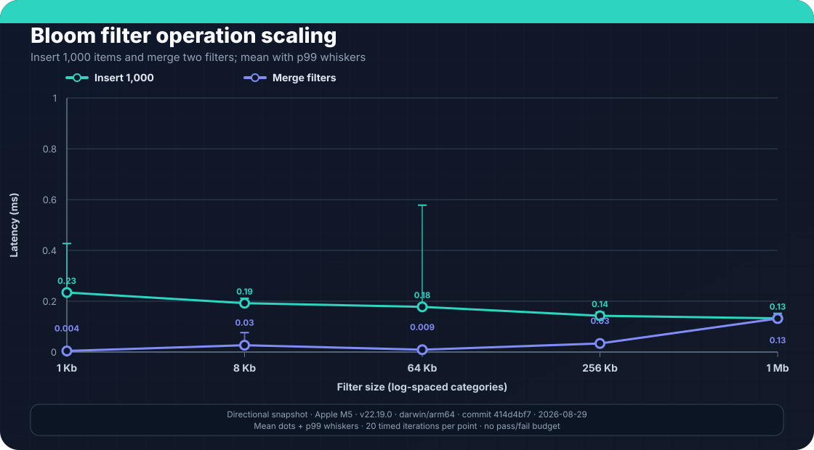
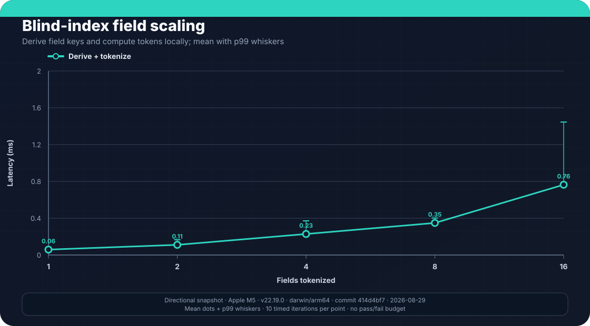

Peerborne makes several deliberate performance tradeoffs to balance security, consistency, and resource use. This page documents the design decisions, benchmark suites, and tuning guidance.

## Design decisions

### Load concurrency cap

On a quorum-bound full load, Peerborne strips inline changes, enumerates the
served change-tree CIDs, and drains at most eight concurrent Helia
`blockstore.get()` calls before invoking `sync()`. Successful gets may populate
the local blockstore; the gate precedes CRDT/ACL mutation, not every local
storage write. The limit applies only to this quorum prefetch, not legacy loads
or ordinary missing/deferred-block sync.

Source: [`peerborne-document.ts`](https://github.com/Peerborne/peerborne/blob/main/packages/core/src/peerborne-document.ts) — `LOAD_PREFETCH_MAX_CONCURRENCY` and the bounded worker pool for blockstore fetches.

### Load quorum defaults

When enabled (the default), document open probes at most `loadQuorumK` distinct
currently connected peer IDs. Effective K is
`min(loadQuorumK, deduplicatedConnectedPeerCount)`. With K ≥ 2, the default Q
is `floor(K / 2) + 1`; an explicit Q is clamped to `[1, K]`. Effective K = 1 is
rejected unless `loadQuorumAllowSinglePeer` is explicitly enabled.

Q peers must agree on an advertised served-frontier hash. Peerborne then
attempts a full load only from that agreeing cohort and structurally binds the
selected response's served frontier to the agreed hash. This is not
Sybil-resistant and does not prove complete interior history:

| Parameter | Default | Rationale |
|-----------|---------|-----------|
| `loadQuorumK` | 3 | Caps the connected peers probed; fewer connected peers reduce effective K |
| `loadQuorumQ` | Majority of effective K | `floor(K / 2) + 1`; an explicit value is clamped to `[1, K]` |
| `loadQuorumTimeoutMs` | 5000 | Per-peer timeout; peer probes run in parallel |
| `loadQuorumAllowSinglePeer` | `false` | Requires an explicit opt-in before effective K = 1 can pass |

Source: [`peerborne-config.ts`](https://github.com/Peerborne/peerborne/blob/main/packages/core/src/peerborne-config.ts). Focused tests cover pure decisions and orchestration with mocked probes; they are not a hostile real-network quorum test.

### Parallel deserialization

Both CRDT adapters use parallel deserialization for cold-cache performance to reduce time-to-interactive when opening large documents:

- [`peerborne-automerge.ts`](https://github.com/Peerborne/peerborne/blob/main/packages/automerge/src/peerborne-automerge.ts)
- [`peerborne-yjs.ts`](https://github.com/Peerborne/peerborne/blob/main/packages/yjs/src/peerborne-yjs.ts)

### Revocation latency

The BeeKEM ratchet-tree key rotation closes the revocation-latency gap of earlier "encrypt new key under old key" schemes. A removed reader cannot derive the new key even if connected at the moment of revocation. Source: [`peerborne-document.ts`](https://github.com/Peerborne/peerborne/blob/main/packages/core/src/peerborne-document.ts) and [`wire-protocols.ts`](https://github.com/Peerborne/peerborne/blob/main/packages/core/src/wire-protocols.ts).

### GC and bounded caches

- **LRU cache**: Used for document change blocks and key material. Limits unbounded memory growth. Verified by [`lru-cache.test.ts`](https://github.com/Peerborne/peerborne/blob/main/packages/core/src/lru-cache.test.ts).
- **Compaction**: Automatic snapshot triggering is disabled by default. A writer can still call `snapshot()` manually when the CRDT provider supports snapshots. With `pruneAfterSnapshot`, snapshot creation prunes the in-memory served sync tree while retaining recent document nodes and preserving ACL nodes. Helia block deletion remains off by default (`gcAfterPrune: false`); when enabled, eligible pruned-block deletion is scheduled asynchronously. Focused tests cover configuration and pruning/GC helper decisions; long-running concurrent multi-peer compaction is not exercised.
- **React hook caches**: Module-level task and subscriber-count caches with ref-counting eviction. Verified by [`hooks-cache.test.ts`](https://github.com/Peerborne/peerborne/blob/main/packages/react/src/hooks-cache.test.ts) and [`hooks-lifecycle.test.ts`](https://github.com/Peerborne/peerborne/blob/main/packages/react/src/hooks-lifecycle.test.ts).

### Local index execution

V2 memory indexes use sorted compound-key arrays with binary-search lookup; incremental insert/delete can still shift `O(N)` entries. IndexedDB uses compound secondary indexes and bounded cursors. Equality/range lookup visits the selected range, but `first` is not yet an early-termination guarantee and `count: 'exact'` exhausts all matches. Execution metadata reports rows visited and whether sorting stayed in index order. See the [indexing design](https://github.com/Peerborne/peerborne/blob/main/docs/indexing-design.md).

## Benchmark suites

Peerborne includes six benchmark suites across two packages. Each suite uses a statistical runner that reports min, max, mean, median, p99, and standard deviation with warmup iterations and optional memory-delta tracking.

The charts below are generated from the committed
[`benchmark-snapshot.json`](https://github.com/Peerborne/peerborne/blob/main/site/src/data/benchmark-snapshot.json)
snapshot. It was collected on Apple M5 hardware with 32 GB RAM, Node.js
22.19.0, and macOS arm64. Most points use 20 timed iterations; the convergence
suite uses four and the blind-index field series uses ten because those suites
intentionally reduce the requested count for their more expensive cases.

Treat the values as a directional, single-machine snapshot—not a performance
guarantee or a comparison with other systems. The convergence chart is a local
simulation, not a browser, relay, or wide-area network measurement. Dots show
means and capped whiskers show p99. No chart establishes a pass/fail budget.

### Core benchmarks

Source: [`packages/core/src/__benchmarks__/`](https://github.com/Peerborne/peerborne/tree/main/packages/core/src/__benchmarks__)

| Suite | File | What it measures |
|-------|------|-----------------|
| **CRDT Sync Latency** | [`crdt-sync-latency.ts`](https://github.com/Peerborne/peerborne/blob/main/packages/core/src/__benchmarks__/crdt-sync-latency.ts) | Per-operation latency of the change pipeline at payload sizes 1 KB to 1 MB: ECDSA P-384 sign/verify, AES-GCM encrypt/decrypt, combined sign+encrypt and decrypt+verify pipelines, JSON serialize/deserialize |
| **Crypto Overhead** | [`crypto-overhead.ts`](https://github.com/Peerborne/peerborne/blob/main/packages/core/src/__benchmarks__/crypto-overhead.ts) | Key generation cost (ECDSA P-384, AES-GCM-256), key rotation at 10 KB, plaintext vs encrypted change propagation across sizes, isolated crypto operation overhead |
| **Convergence Simulation** | [`convergence-simulation.ts`](https://github.com/Peerborne/peerborne/blob/main/packages/core/src/__benchmarks__/convergence-simulation.ts) | Simulated multi-peer convergence: 2–32 peers making concurrent edits through the full sign-encrypt-broadcast-decrypt-verify pipeline, measures time-to-convergence, message count, and bandwidth |







### Index benchmarks

Source: [`packages/index/src/__benchmarks__/`](https://github.com/Peerborne/peerborne/tree/main/packages/index/src/__benchmarks__)

| Suite | File | What it measures |
|-------|------|-----------------|
| **Index Query Scaling** | [`index-query-scaling.ts`](https://github.com/Peerborne/peerborne/blob/main/packages/index/src/__benchmarks__/index-query-scaling.ts) | Query latency vs index size: 100–100K documents. Exact-match, range, prefix, compound, and sorted queries against MemoryIndexStorage, plus single-document update cost and full-scan baseline |
| **Bloom Filter Scaling** | [`bloom-filter-scaling.ts`](https://github.com/Peerborne/peerborne/blob/main/packages/index/src/__benchmarks__/bloom-filter-scaling.ts) | Insert throughput at filter sizes 1K–1M bits, positive/negative query time, false-positive rate at fill counts 100–10K, serialization/deserialization time, CRDT merge (join) time, memory footprint |
| **Blind Index Performance** | [`blind-index-perf.ts`](https://github.com/Peerborne/peerborne/blob/main/packages/index/src/__benchmarks__/blind-index-perf.ts) | Encrypted search operations: field-key derivation (HKDF), single/compound token generation, token match/mismatch comparison, field-count scaling (1–16 fields), batch throughput (100 tokens) |







## Performance-aware tests

Several test suites exercise performance-critical paths:

| Test suite | Path | What it covers |
|-----------|------|----------------|
| Load quorum | [`load-quorum.test.ts`](https://github.com/Peerborne/peerborne/blob/main/packages/core/src/load-quorum.test.ts) | Quorum decision logic, hash-binding comparison, config validation |
| Load quorum orchestrator | [`load-quorum-orchestrator.test.ts`](https://github.com/Peerborne/peerborne/blob/main/packages/core/src/load-quorum-orchestrator.test.ts) | Multi-peer quorum scenarios including timeout and insufficient-response paths |
| LRU cache | [`lru-cache.test.ts`](https://github.com/Peerborne/peerborne/blob/main/packages/core/src/lru-cache.test.ts) | Eviction correctness, capacity bounds, size tracking |
| Blockstore GC | [`blockstore-gc.test.ts`](https://github.com/Peerborne/peerborne/blob/main/packages/core/src/blockstore-gc.test.ts) | CID collection, deletable-filtering, tree-shape coverage |
| Compaction | [`compaction.test.ts`](https://github.com/Peerborne/peerborne/blob/main/packages/core/src/compaction.test.ts) | Config defaults, GC decision logic, prune+GC integration |
| Network statistics | [`network-stats.test.ts`](https://github.com/Peerborne/peerborne/blob/main/packages/core/src/network-stats.test.ts) | Message/byte counters, connection tracking, snapshot isolation |
| React hook caches | [`hooks-cache.test.ts`](https://github.com/Peerborne/peerborne/blob/main/packages/react/src/hooks-cache.test.ts) and [`hooks-lifecycle.test.ts`](https://github.com/Peerborne/peerborne/blob/main/packages/react/src/hooks-lifecycle.test.ts) | Cache population, ref-counted eviction, per-document isolation |
| Cross-NAT throughput | [`nat-resilience.spec.ts`](https://github.com/Peerborne/peerborne/blob/main/e2e/integration/nat-resilience.spec.ts) | 10-message bidirectional burst across NAT boundaries with delivery threshold |

## Document size guidance

- **~1 MB threshold**: Consider splitting documents when encoded state exceeds ~1 MB. Decoding and encoding cost degrades with very large documents.
- **Browser limits**: Tens of MB may cause performance issues in browsers.
- **Tombstone accumulation**: Operations that frequently delete and re-add items in Y.Array create permanent tombstones (~40–80 bytes each) that grow document size monotonically. Batch mutations in [Yjs transactions](https://docs.yjs.dev/getting-started/working-with-shared-types#transactions) to reduce overhead.
- **Nesting depth**: Keep nested types to 2–3 levels.

See the [Yjs schema design cookbook](../../cookbook/yjs-schema-design/) for detailed guidance on document structure and size management.

## Network latency

- Local CRDT mutations become visible before the outbound storage/publication
  pipeline completes, so the local UI does not wait for a network round trip.
- No end-to-end update-latency budget is enforced, and relay-backed live
  post-load browser propagation is not yet an acceptance test.
- WebTransport and direct DCUtR/WebRTC paths are configured but do not yet have
  transport-specific Peerborne synchronization evidence in CI; the current
  cross-NAT document proof uses Circuit Relay for initial history load.

## Relay tuning

When operating a Circuit Relay server under load:

- Increase `ulimit -n` for many concurrent connections.
- Set `NODE_OPTIONS=--max-old-space-size=4096` for memory headroom.
- Monitor event loop lag.
- For large deployments, tune GossipSub parameters (`D`, `Dlo`, `Dhi`, `heartbeatInterval`) in [`relay-server/src/index.ts`](https://github.com/Peerborne/peerborne/blob/main/relay-server/src/index.ts).
- Client-side: `circuitRelayTransport({ reservationConcurrency: 1 })` — increase for redundancy at the cost of additional relay connections.

See the [running a relay cookbook](../../cookbook/running-a-relay/) for setup instructions.

## Network statistics

`NetworkStats` provides counters for messages/bytes sent and received, document open/close lifecycle events, and connection tracking. Applications can use `snapshot()` to inspect current state. Verified by [`network-stats.test.ts`](https://github.com/Peerborne/peerborne/blob/main/packages/core/src/network-stats.test.ts).

## Current limitations

- **No pass/fail performance budgets.** Benchmarks exist but have no thresholds in CI. A regression that doubles latency would not be caught automatically.
- **Bundle size.** The core barrel eagerly imports the complete networking/storage stack. Example application bundles are approximately 2.0 MB minified.
- **No automated bottleneck detection.** There is no profiling or flame-graph generation in CI.

## Running benchmarks

```sh
# Core benchmarks
yarn workspace @peerborne/core benchmark --iterations 100

# Index benchmarks; bound the largest query dataset for a smoke run
yarn workspace @peerborne/index benchmark --iterations 100
yarn workspace @peerborne/index benchmark --iterations 1 --max-documents 100
```

Both suites output Markdown tables with statistical summaries. The `--iterations` flag controls the sample count (default 100); `--max-documents` bounds index-query scaling only.

To replace the committed measurement snapshot and regenerate its SVG charts,
run both suites with the recorded parameters, then collect and render:

```sh
yarn workspace @peerborne/core benchmark --iterations 20
yarn workspace @peerborne/index benchmark --iterations 20 --max-documents 10000
yarn workspace @peerborne/site benchmarks:snapshot --core-iterations 20 --index-iterations 20 --max-documents 10000
yarn workspace @peerborne/site charts:generate
yarn workspace @peerborne/site charts:test
```

Benchmark collection is intentionally separate from SVG rendering. Rerunning a
benchmark produces new measurements; rendering the same committed JSON snapshot
must produce byte-identical charts, which the site build checks.
