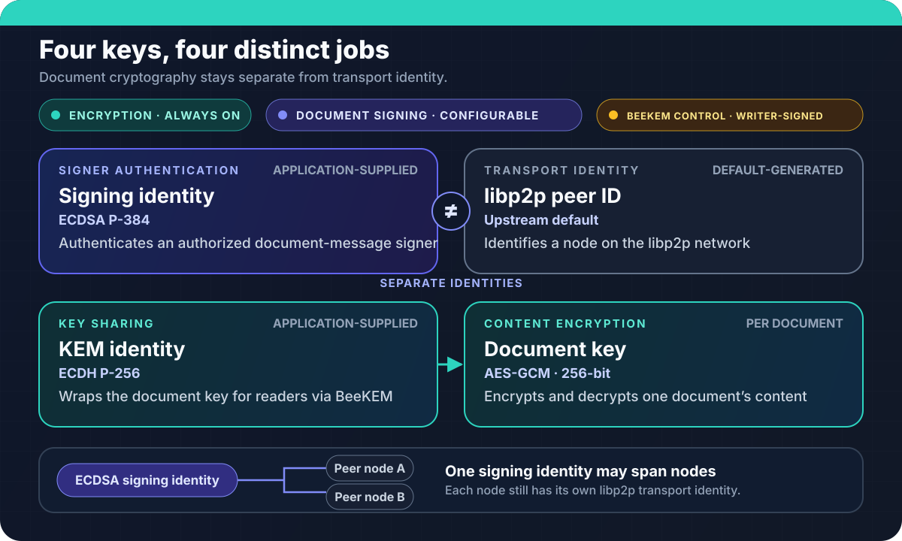

## Overview

Peerborne encrypts stored change payloads, ordinary GossipSub sync envelopes,
and load responses. With document signing enabled (the default), those outgoing
`CRDTSyncMessage` payloads are signed before their serialized envelopes are
encrypted; load requests also carry a signature. The separate CID-addressed
stored payload has no writer signature.
Relay and other infrastructure not given the document key handle ciphertext
rather than document plaintext; they never need a signing private key. During
normal post-load sync, once a trusted writer set exists, a peer without a
current writer key cannot produce an ordinary sync message that receivers
accept. A first load has no prior writer set for authenticating its selected
outer response and instead uses the narrower configured quorum/CID gates.

## Identity and trust roots

| Key | Algorithm | Purpose | Managed by |
|---|---|---|---|
| **Signing key** | ECDSA P-384 | Authenticates an authorized document-message signer | Application |
| **KEM key** | ECDH P-256 | Opens recipient-sealed Welcome onboarding payloads | Application |
| **Document key** | AES-GCM (256-bit; bundled document-key path) | Encrypts/decrypts document content | Peerborne (per-document) |
| **libp2p peer ID** | Upstream default | Identifies the node on the libp2p network | Generated by default; configurable |



**Evidence boundary.** This diagram maps implemented key roles and documented configuration behavior; it does not imply that Peerborne provides application-key onboarding, recovery, or complete revocation workflows.

The signing key and KEM key are **application-supplied**. Peerborne does not generate, store, recover, or back up user keys — key management is entirely the application's responsibility.

The libp2p peer ID is separate from the signing identity. This means:
- Changing the libp2p key (e.g., relay restart) does not change the document signing identity
- The same signing identity can be used across multiple libp2p nodes
- Applications can supply libp2p private-key configuration instead of using the generated upstream default

## Signed invitations

The initial online invitation protocol binds three signed envelopes:

1. The founder signs an expiring offer containing the document ID, requested
   role, issuer identity, and founder rendezvous addresses.
2. The recipient signs a join request bound to the exact offer, their signing
   identity, and their raw P-256 KEM public key.
3. The founder signs an acceptance bound to both earlier envelopes. Its BeeKEM
   Welcome is sealed to the recipient KEM key, and its initial document state
   is encrypted under the document key.

Accepting an invitation verifies every binding and the resulting ACL before
opening the document. Failure never falls back to new-document creation. See
[Invite a collaborator](../../cookbook/invitations/) for the API and its
founder-plus-one, online-only trust boundary.

Before changing membership, the founder also performs a fail-closed capacity
check. The bundled Automerge JSON providers and P-384/SHA-384 SubtleCrypto
declare the one profile whose bounds Peerborne tests. It combines the retained
sync tree, complete keychain, latest snapshot, tips, signature, projected ACL
growth, encryption framing, and a 128 KiB reserve under the 1 MiB wire-field
cap. A custom provider is rejected unless it deliberately implements the same
capacity-profile attestation; doing so makes that provider responsible for
preserving every declared bound. The exact sealed Welcome and encrypted
bootstrap are checked again after construction.

An offer is still a bearer capability. Its self-signature does not identify a
human or organization, and the first person who obtains the link can claim its
role. Applications should deliver it through an authenticated private channel
or separately verify the issuer fingerprint.

## Implemented authorization

### Reader/writer ACL

Each document has an access control list with two roles:

```ts
// Grant read access (the second argument is the reader's raw
// SEC1-uncompressed P-256 ECDH public key bytes, optional)
await document.addReader(peerSigningPublicKey, readerKemPublicKeyBytes);

// Grant write access
await document.addWriter(peerSigningPublicKey);
```

Before calling `addReader`, a founder node must set its KEM key pair:

```ts
await document.setKemKeyPair(kemKeyPair);
```

- **Readers** can receive recipient-sealed keychain material through Welcome onboarding and decrypt content for epochs whose keys they hold.
- **Writers** sign ordinary sync messages that carry new changes. During post-load sync, receivers verify the outer signature against their current writer list before applying the message when signing is enabled.
- **Ordinary document sync/load signing is configurable.** BeeKEM Welcome and PathUpdate membership-control messages remain writer-authenticated even when `enableSigning` is `false`.

### Current-writer authorization only

When document signing is enabled, ordinary inbound sync envelopes are
authorized against that replica's current writer ACL. Grants do not expire
automatically; they remain accepted until that replica applies a writer-removal
ACL update. With `enableSigning: false`, ordinary inbound sync skips this
writer-signature gate. Beyond this gate, there is no:

- Role-based access beyond reader/writer
- Delegation or sub-key authorization (UCAN capabilities exist but are not integrated)
- Rate limiting or abuse prevention

### UCAN capabilities

UCAN (User Controlled Authorization Networks) helpers exist in `@peerborne/core` as a standalone module. They are **not integrated** into the document change path. The UCAN module can:

- Issue capability tokens delegating specific permissions
- Verify capability chains
- Encode delegation proofs

But the document change path does not check UCAN tokens. UCAN integration is a future capability.

## Encryption and history visibility

Peerborne encrypts stored payloads and wire envelopes through the configured
auth provider. The bundled document providers generate or import 256-bit
AES-GCM document keys. The lower-level `SubtleCrypto` auth primitive also
supports AES-CTR and AES-CBC, but that primitive support is not a bundled
document-key path. Peers can decrypt content only when they hold the needed
epoch key.

`historyVisibility` controls which document-key epochs are supplied in some
load and Welcome responses. It does not remove or redact retained CRDT
operations, force a key rotation per operation, or guarantee that earlier
content is unavailable: one epoch key can decrypt multiple operations, and a
sync tree or snapshot can carry retained history. Treat `current_only` and
`since_invited` as key-distribution filters, not deletion or historical-content
confidentiality guarantees.

The initial invitation API therefore requires an explicit
`historyVisibility = 'full_history'` choice and rejects the other modes before
changing membership. Invitation recipients may receive retained operations for
values that were later changed or deleted.

```text
stored payload = encrypt(document key, serialized CRDT change) → CID
sync/response  = encrypt(document key, serialize(CRDTSyncMessage + optional signature))
```

### Ordinary document signing configuration

Document signing is controlled by `PeerborneConfig.enableSigning` (default: `true`):

| Setting | Effect |
|---|---|
| **`enableSigning: true`** (default) | Ordinary sync messages and load responses are signed with ECDSA P-384, then serialized and encrypted with the document key; load requests are signed separately. Post-load receivers verify outer message signatures against current writers. |
| **`enableSigning: false`** | Stored payloads, sync envelopes, and load responses remain encrypted with the document key, but application-level signing and verification for ordinary sync messages, load requests and responses, snapshots, and document key-update messages are bypassed. A peer able to decrypt the affected traffic can forge those messages. Signing-enabled receivers reject unsigned ordinary messages, so mixed settings do not provide bidirectional interoperability. BeeKEM Welcome and PathUpdate messages are separate exceptions described below. |

BeeKEM Welcome and PathUpdate membership-control protocols are a deliberate
exception to that toggle: their outer messages remain writer-signed, but they
are not ordinary whole-message document-key envelopes. A Welcome ECIES-seals
its onboarding payload to the recipient's KEM key. A PathUpdate instead carries
path secrets individually encrypted to the surviving BeeKEM subtrees.

## Initial-load quorum

Before accepting a remote document state, Peerborne can require **Q-of-K**
distinct currently connected peers to agree on a served-frontier hash. This
reduces the risk of one peer unilaterally selecting the frontier; it does not
authenticate the responder-supplied interior tree or prove that the served
history is complete. Quorum is configured via `PeerborneConfig`:

```ts
// Override loadQuorumK and loadQuorumQ on the complete config:
await swarm.initialize({
  ...defaultConfig(defaultBootstrapConfig([])),
  loadQuorumK: 3,  // probe up to 3 peers
  loadQuorumQ: 2,  // require agreement from at least 2
});

// Documents are then opened normally; quorum runs automatically:
const document = swarm.doc('/shared-note');
await document.open();
```

The quorum check:
- Probes up to `loadQuorumK` peers for their current frontier hashes
- Proceeds only when at least `loadQuorumQ` peers agree on the same frontier
- Rejects the load if agreement cannot be reached
- Is **not Sybil-resistant** — a peer controlling multiple identities can subvert it

## Revocation

### Writer revocation

When a writer is removed from the ACL:
- With document signing enabled, after a replica applies the update it invalidates its cached writer set and rejects subsequently verified ordinary sync envelopes signed only by the removed key
- There is no globally simultaneous cutover: a replica that has not applied the best-effort ACL update still evaluates against its older writer set, and an in-flight message is judged against the set current when that replica verifies it
- `removeWriter()` revokes write authorization, not BeeKEM reader membership; an identity that remains a reader retains its existing read access, while `removeReader()` separately attempts a BeeKEM key rotation
- Past contributions remain in the document; stored payloads do not carry persistent per-block writer attribution
- There is no mechanism to retroactively remove those past contributions

```ts
await document.removeWriter(revokedPeerSigningPublicKey);
```

### Reader revocation

Reader revocation is more complex. Since readers hold the document key, simply removing them from the ACL does not prevent them from decrypting blocks they've already received.

What exists:
- **BeeKEM key separation** can generate new document keys that exclude a former member
- **PathUpdate** is a best-effort mechanism to notify peers about ACL changes
- Both mechanisms are **incomplete**: BeeKEM rekey state is memory-only (lost on restart), and PathUpdate has no delivery guarantee

```ts
// Be aware: BeeKEM state is memory-only
await document.removeReader(revokedPeerSigningPublicKey);
```
`removeReader` generates and distributes BeeKEM PathUpdates internally as part of the operation. PathUpdate distribution is best-effort — there is no guarantee that ACL change notifications reach all peers.

### Limitations of revocation

- **No absolute guarantee.** A revoked reader with a copy of the encrypted blocks and the old document key can still decrypt them offline.
- **BeeKEM state is lost on restart.** If the node restarts, it loses track of which keys have been invalidated.
- **PathUpdate is not guaranteed.** There is no acknowledgment or retry mechanism.
- **Key reuse risk.** If the application reuses KEM key pairs across documents, revoking access to one document may not fully revoke it from another.

## Metadata and hostile infrastructure

Relays and other infrastructure nodes can observe:
- Peer IDs and connection patterns
- Document topic IDs (derived from document IDs)
- Message timing, frequency, and size
- Network topology

This metadata may reveal:
- Which peers are collaborating on which documents
- When collaboration is happening (message frequency)
- The rough size of documents (encrypted block sizes)
- The network location of peers (IP addresses, relay selection)

Peerborne does not protect against traffic analysis or metadata leakage.

## CI-backed evidence

Verified in CI:

- ECDSA P-384 signing and verification of sync-message payloads
- AES-GCM encryption and decryption of document blocks
- Reader/writer ACL enforcement (writer check before accepting changes)
- BeeKEM key encapsulation and decapsulation
- UCAN capability issuance and verification (standalone module)
- Encrypted document retrieval through Circuit Relay
- Distinct-identity invitation acceptance and bidirectional post-join
  convergence through Circuit Relay

Not verified:

- Reader revocation with key rotation and live peer notification
- Conflicting real peers serving adversarial shadow-tree payloads during quorum loading
- PathUpdate delivery across NAT boundaries
- Invitation or replay-state persistence across process restart
- Offline invitation acceptance or relay failover
- Resistance to Sybil attacks on quorum
- Key recovery or backup flows

## Next steps

- [Architecture](../architecture/) — how encryption fits into the data flow
- [Password manager cookbook](../../cookbook/password-manager/) — key sharing and ACL management example
- [Limitations](../limitations/) — complete security limitations
